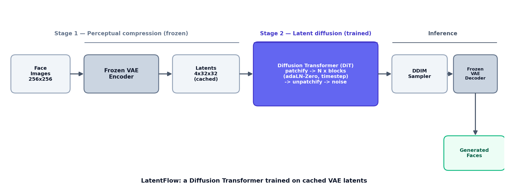
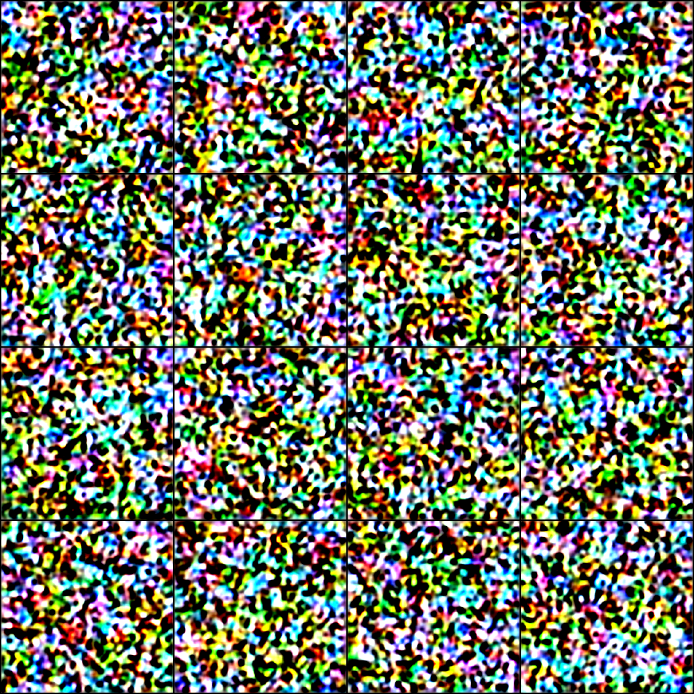

# LatentFlow

**A Diffusion Transformer (DiT) image generator built from scratch in PyTorch, trained with latent diffusion on CelebA-HQ faces.**

LatentFlow replaces the U-Net backbone of a standard latent diffusion model with a Transformer that denoises in the VAE latent space. It implements the DiT architecture, the diffusion process (DDPM training, DDIM sampling), a two-stage latent-caching pipeline, and FID evaluation — all from scratch, with a frozen pretrained VAE handling only perceptual compression.



---

## Results

| Model | Params | Dataset | Resolution | Latent | Sampler | FID ↓ | Train compute |
|---|---|---|---|---|---|---|---|
| DiT-S/2 | 33.4M | CelebA-HQ | 256×256 | 4×32×32 | DDIM (50 steps, η=0) | **82.4** (5,000 samples, EMA) | 1× T4, ~30k steps |

> FID measured with clean-FID over 5,000 generated samples against CelebA-HQ. This is a deliberately small-scale, single-GPU reproduction of the DiT architecture — the focus is engineering correctness and an honest, reproducible evaluation, not a state-of-the-art score. FID drops substantially with more training steps or a larger model (see [what I'd do next](#design-choices--what-id-do-next)).



---

## Why a Transformer instead of a U-Net?

Latent diffusion models conventionally denoise with a convolutional U-Net. The DiT line of work showed that a plain Transformer operating on latent patches works at least as well, and scales more predictably: as you add compute to the Transformer (more depth, width, or tokens), sample quality improves in a smooth, measurable way, with FID tracking the model's forward-pass cost. That predictability — and the fact that a Transformer reuses the same well-understood attention machinery rather than hand-designed convolutional blocks — is the reason this project uses a DiT. LatentFlow is a small-scale, from-scratch reproduction of that idea rather than a state-of-the-art run.

---

## The two-stage latent-diffusion pipeline

**Stage 1 — perceptual compression (frozen VAE).** A pretrained Stable Diffusion VAE encodes each 256×256 image into a 4×32×32 latent. The VAE is never trained; it only compresses pixels into a lower-dimensional space where diffusion is far cheaper. These latents are computed **once and cached to disk**, so training never re-runs the encoder — this is the main compute saving.

**Stage 2 — latent diffusion (trained DiT).** The DiT learns to denoise the cached latents. Each latent is patchified into tokens, processed by a stack of Transformer blocks conditioned on the diffusion timestep via adaLN-Zero, then unpatchified back to a latent-shaped noise prediction. Training is standard DDPM: add noise at a random timestep, predict it, minimize MSE.

**Inference.** Start from Gaussian noise in latent space, denoise iteratively with the DDIM sampler (fast, deterministic), then decode the final latent back to a face with the frozen VAE decoder.

---

## Setup

```bash
git clone https://github.com/<your-username>/latentflow.git
cd latentflow
python -m venv .venv && source .venv/bin/activate
pip install -r requirements.txt
```

Download CelebA-HQ (256×256) and place the images under `data/celebahq/`.

## Usage

### 1. Pre-compute & cache latents (run once)
```bash
python scripts/precompute_latents.py --config configs/default.yaml
```
Encodes the dataset with the frozen VAE and writes latents to `latents/`.

### 2. Train
```bash
python scripts/train.py --config configs/default.yaml --preset s2
# resume from a checkpoint:
python scripts/train.py --config configs/default.yaml --resume checkpoints/ckpt_step5000.pt
```
`--preset s2` trains the lightweight DiT-S/2 (recommended for a single GPU / Colab). Use `--preset b2` for the larger model, or `--preset config` to use the `dit` block in the config. Logs and decoded previews go to `runs/` (view with `tensorboard --logdir runs`).

### 3. Sample
```bash
python scripts/sample.py --ckpt checkpoints/ckpt_final.pt --n 16
```
Saves a grid to `assets/samples.png` and individual images to `samples/`.

### 4. Evaluate FID
```bash
pip install clean-fid
python scripts/eval_fid.py --ckpt checkpoints/ckpt_final.pt \
    --real-dir data/celebahq --num-samples 5000
```
Prints FID alongside the sample count and sampler settings.

---

## Repository structure

```
latentflow/
├── configs/
│   └── default.yaml              # single source of truth for all hyperparameters
├── latentflow/
│   ├── models/
│   │   ├── dit.py                # DiT, DiTBlock, PatchEmbed, adaLN-Zero, presets
│   │   └── vae.py                # frozen pretrained VAE wrapper
│   ├── diffusion/
│   │   ├── schedule.py           # beta schedules + alpha precomputation
│   │   └── gaussian_diffusion.py # q_sample, training_loss, DDPM + DDIM sampling
│   ├── data/
│   │   └── dataset.py            # CelebA-HQ images + cached-latent dataset
│   └── utils/                    # config, seeding, logging
├── scripts/
│   ├── precompute_latents.py     # Stage 1: encode + cache latents
│   ├── train.py                  # Stage 2: train the DiT (AMP, EMA, resume)
│   ├── sample.py                 # generate a grid of faces
│   └── eval_fid.py               # compute FID vs real CelebA-HQ
└── assets/
    ├── architecture.png
    └── make_diagram.py
```

---

## Design choices & what I'd do next

- **adaLN-Zero conditioning.** Timestep information modulates each block's normalization (scale/shift/gate) rather than being concatenated as tokens — the conditioning mechanism from the DiT paper, which trains more stably.
- **EMA weights for sampling.** An exponential moving average of the parameters is tracked during training and used at inference; for diffusion this noticeably improves sample quality over the raw weights.
- **Cached latents + mixed precision** keep a from-scratch run feasible on modest hardware.
- **Next steps:** v-prediction instead of ε-prediction; classifier-free guidance with CelebA-HQ attributes for conditional generation; a larger DiT-B/2 run for a lower FID; and higher-resolution latents.

## References

- Peebles & Xie, *Scalable Diffusion Models with Transformers* (2023). [arXiv:2212.09748](https://arxiv.org/abs/2212.09748)
- Rombach et al., *High-Resolution Image Synthesis with Latent Diffusion Models* (2022). [arXiv:2112.10752](https://arxiv.org/abs/2112.10752)
- Ho et al., *Denoising Diffusion Probabilistic Models* (2020). [arXiv:2006.11239](https://arxiv.org/abs/2006.11239)
- Song et al., *Denoising Diffusion Implicit Models* (2021). [arXiv:2010.02502](https://arxiv.org/abs/2010.02502)

## License

MIT
