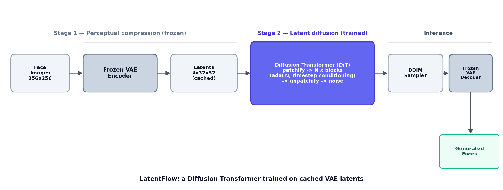
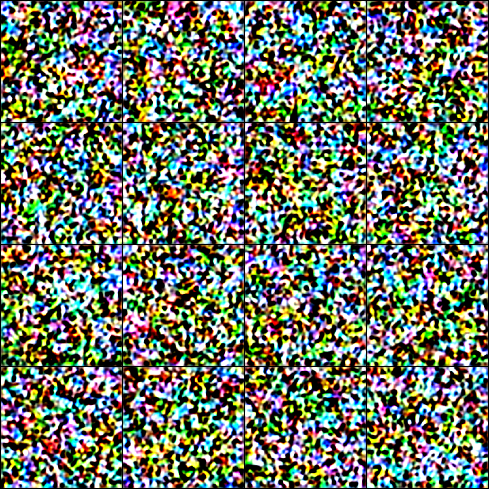

# LatentFlow

LatentFlow generates new face images starting from random noise. It is a small image generator written in PyTorch and trained on the CelebA-HQ face photos.

## Why I built it

To understand how image generators work inside, by building the noise-removing model myself on a small budget.

## How it works

1. **Compress.** Each 256×256 photo is compressed into a small 4×32×32 grid of numbers using the pretrained Stable Diffusion image compressor (a VAE). It is frozen — I did not train it.
2. **Add noise.** Noise is added to the compressed photo step by step, over 1,000 steps, until nothing but noise is left.
3. **Learn to predict the noise.** A small transformer is shown a noisy compressed photo, is told which step it is on, and learns to predict the noise that was added. This is the only part I trained.
4. **Generate.** To make a new image, start from pure noise and remove it in 50 steps (DDIM).
5. **Decompress.** The same frozen VAE turns the result back into an image.



## Model size and training

- Model: DiT-S/2 — 12 transformer layers, width 384, 6 attention heads, about 33.4M parameters. These are the values in [configs/default.yaml](configs/default.yaml).
- Training: about 30k steps on one free Kaggle T4 GPU.
- The model is unconditional: it makes a random face and cannot be told what kind of face to make.

## Results



**FID 82.4** on 5,000 generated images (50 DDIM steps), compared against CelebA-HQ. Lower is better; published models reach single digits with far more compute, so this is a small-budget result.

The FID was measured once on Kaggle; log not saved.

## Known limits

- The model is small and training was short.
- FID from 5,000 samples reads higher than from 50,000, so this number is not directly comparable to published ones.
- The averaged copy of the weights (EMA), which is used for generating, started from random weights with a slow update. This likely hurt quality. Fixing it needs retraining.

## How to run

Set up:

```bash
git clone https://github.com/pranjal25r/LatentFlow.git
cd LatentFlow
python -m venv .venv && source .venv/bin/activate
pip install -r requirements.txt
```

Download CelebA-HQ (256×256) and put the images in `data/celebahq/`.

1. Compress the photos once (saved to `latents/`):

   ```bash
   python scripts/precompute_latents.py --config configs/default.yaml
   ```

2. Train. The model is built from the `dit` block in the config:

   ```bash
   python scripts/train.py --config configs/default.yaml
   # continue from a checkpoint:
   python scripts/train.py --config configs/default.yaml --resume checkpoints/ckpt_step2000.pt
   ```

3. Generate faces (grid saved to `assets/samples.png`, single images to `samples/`):

   ```bash
   python scripts/sample.py --ckpt checkpoints/ckpt_final.pt --n 16
   ```

4. Measure FID:

   ```bash
   python scripts/eval_fid.py --ckpt checkpoints/ckpt_final.pt \
       --real-dir data/celebahq --num-samples 5000
   ```

5. Quick checks that need no data or GPU:

   ```bash
   python test_diffusion.py
   python -m latentflow.diffusion.gaussian_diffusion
   ```

## License

MIT
